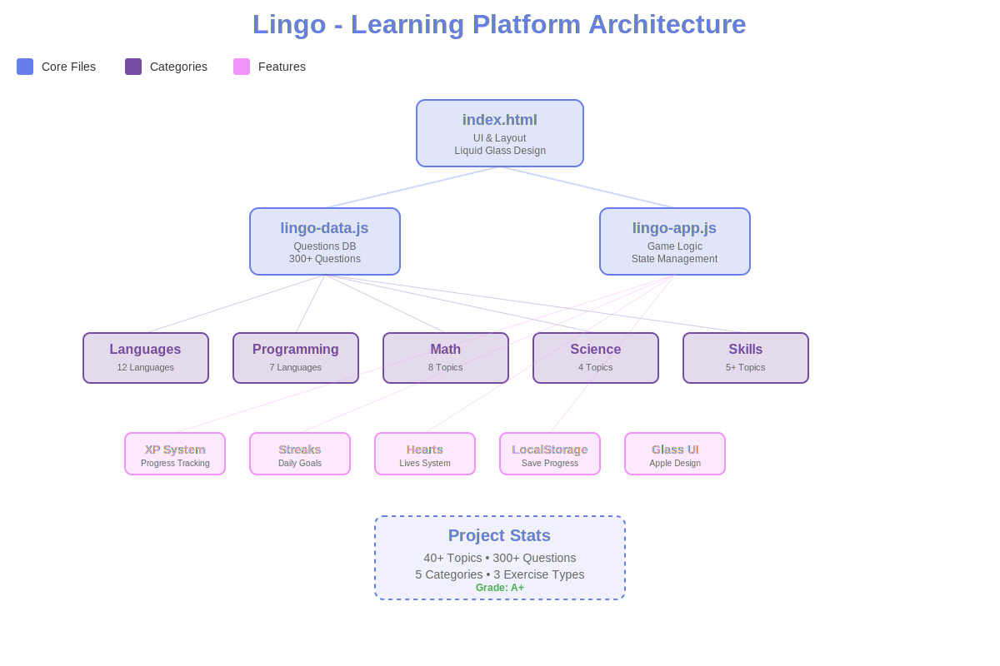

# Lingo


A beautiful language and skill learning platform with Apple-inspired liquid glass UI.



## What it does

Learn languages, programming, math, science, and more through interactive exercises:

**Languages (12):** Spanish, French, German, Italian, Portuguese, Japanese, Chinese, Korean, Russian, Arabic, Hindi, Dutch

**Programming (7):** JavaScript, Python, Rust, C++, Java, Go, SQL

**Math (10):** Arithmetic, Algebra, Geometry, Trigonometry, Pre-Calculus 11/12, Calculus, Statistics, Linear Algebra, Logic

**Science (5):** Physics, Chemistry, Biology, Anatomy & Physiology, Astronomy

**Skills (5+):** Chess, Music Theory, Music History, World History, Geography

## Features

- Multiple exercise types: translation, sentence building, typing, math problems
- Experience points and daily streak tracking
- Lives system to maintain focus
- Beautiful glassmorphism effects with animated backgrounds
- Instant feedback with visual animations
- Progress persistence via localStorage
- 40+ topics, 330+ questions

## Quick Start

```bash
# Clone the repository
git clone https://github.com/nulljosh/lingo.git
cd lingo

# Open in browser
open index.html

# Or serve locally
python -m http.server 8000
# Visit http://localhost:8000
```

## Project Structure

```
lingo/
├── index.html      # Main application UI
├── lingo-data.js   # Questions and categories database
├── lingo-app.js    # Application logic
├── icon.svg        # Project icon
├── project-map.svg # Architecture diagram
└── README.md       # Documentation
```

## Adding Content

Add new questions to `lingo-data.js`:

```javascript
questions.newTopic = [
    {
        type: 'mathChoice',
        question: 'Your question',
        answer: 'Correct answer',
        choices: ['Correct answer', 'Wrong 1', 'Wrong 2', 'Wrong 3']
    }
];
```

## Tech Stack

- Pure HTML/CSS/JavaScript (no build process)
- CSS Glass morphism with backdrop filters
- LocalStorage for progress persistence
- Modular architecture for easy expansion

## Browser Support

Works in modern browsers (2020+) with support for:
- CSS backdrop-filter
- CSS Grid & Flexbox
- ES6 JavaScript
- LocalStorage

## License

MIT

---

Built by Joshua Trommel
